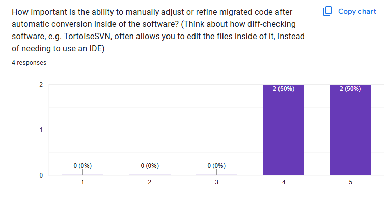
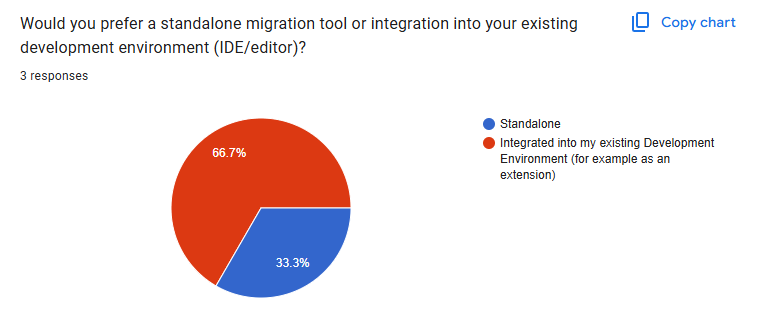
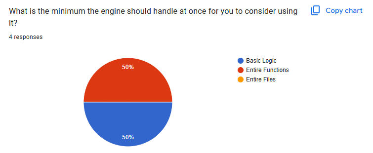
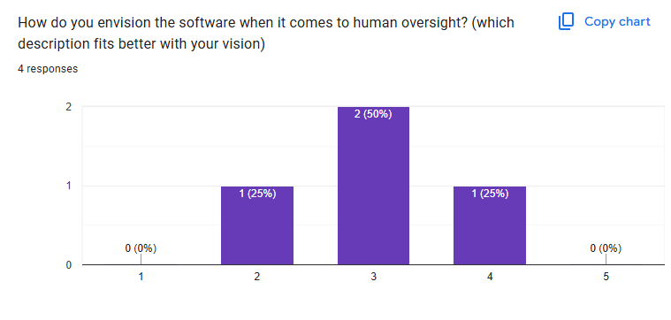
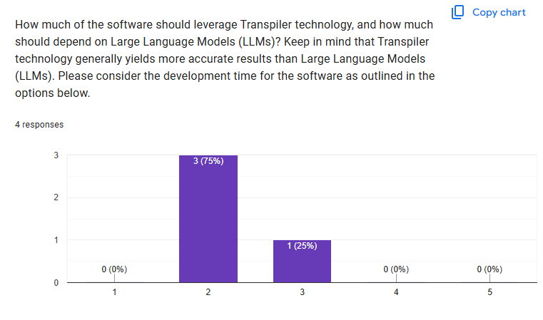
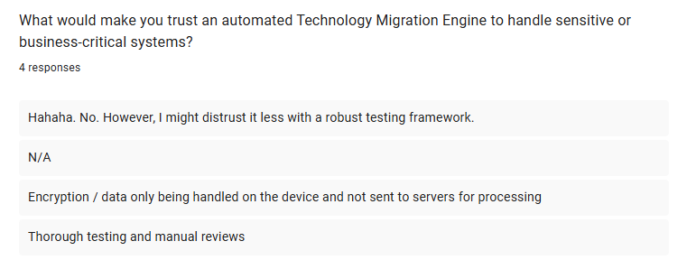
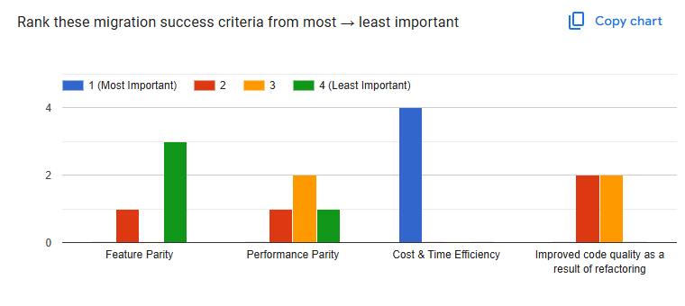

# Requirement Analysis 

Unless otherwise specified, the term “users” refers to the developer questionnaire that was administered.

## Requirement 1

The application must allow for the manually adjusting or refining of migrated code (for example, similar to how it's done in the diffchecker inside TortoiseSVN).

### Validation

[ ] The specificed workflow is supported

### Justification

Users have declared this feature is important, with 50% of user rating a 4 out of 5, and 50% rating it a 5.

## Requirement 2 <!--[[req1spec| ]]  Implemented in [[#req1impl|main.js]]  -->

The application must operate within a standalone window, but be very easy to open and keep open.

### Validation

[x] The application opens in 5 seconds

[ ] The window is resizable

### Justification

2 thirds of users have expressed desire to have the tool integrated into their existing development environment. However, requirement 1 is impossible to implement within the VSCode extension environment because of limitations with the API provided. Therefore, due to the fact that users report requirement 1 is more important than requirement 2, the compromise is to instead have the application as a standalone application that is easy to use within the standard workflow of a developer.

## Requirement 3 

The application must handle at minimum entire functions.

### Validation

[ ] The application works well on functions

### Justification:

50% of users would be okay with basic logic, however 50% would only consider using the software if it handled entire functions.

## Requirement 4 

The application must have a good balance between automation and human oversight.

### Validation

[ ] The application waits for user input before exporting file

[ ] The application is clear in what is automated, and what is left for human verification

[ ] Consider adding ways for the developer to choose the level of oversight that he wants 

### Justification

50% of users reported that the balance on the "Automation (1) - Human oversight (5)" scale should be 3 out of 5, with the rest of users choosing either 2 or 4.

## Requirement 5

The application must not be overly reliant on large language models.

### Validation

[ ] The application handles, at the minimum, structural elements programatically

### Justification

Three fourths of users have voted 2 out of 5 on the "Minimise LLM Usage (1) - Maximise LLM Usage (5)" scale

## Requirement 6

There should be an option for the software to use a local LLM, and the data to not be sent to servers for processing

### Validation

[ ] The specified functionality is provided in some arrangement

### Justification

Users have reported this as a security concern

## Requirement 7

The software must be tested and well-maintained.

### Validation

[ ] There is a test for any node type in both javaAstGenerator and javaCodeGenerator

[ ] A minimum of 10 real-life examples of full Perl Catalyst files have been tested holistically

[ ] A minimum of 5 industry examples of full Perl Catalyst files have been tested holistically

### Justification

Users have reported this as a factor that would make them trust the software.

## Requirement 8

The software must be cost & time efficient

### Validation

[ ] Processing a 200 line perl catalyst file should take no longer than one minute

[ ] The solution for local LLM chosen is one that is free of cost beyond the price for the local infrastructure providing the compute

### Justification

Users have reported this as an important aspect for migration success.

